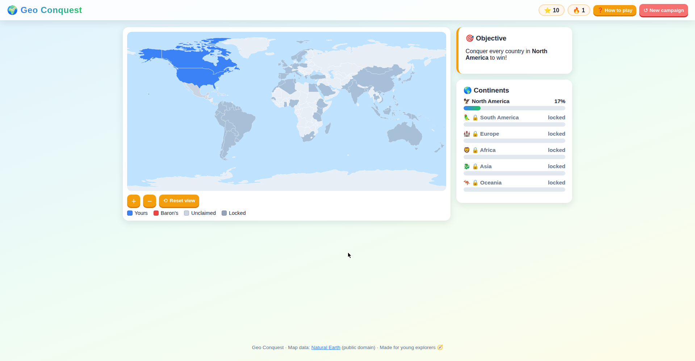

# 🌍 Geo Conquest

**Conquer the world, one geography question at a time!**

Geo Conquest is a single-player strategy-quiz game for young explorers (built with a grade‑7 geography lover in mind). Tap countries on an interactive world map, answer geography questions to conquer them, and outsmart the mischievous **Baron von Blunder** — your AI rival who steals any country you fumble!



## 🎮 How to play

1. **Pick a mode** — 🏝️ *Continent Quest* (conquer one continent to win) or 🌐 *World Conquest* (hard mode: conquer all six!).
2. **Choose your starting continent**, then tap a country to plant your flag 🚩.
3. **Tap any country** in your current continent to challenge it, pick a difficulty (😊 Easy +10 · 🤔 Medium +20 · 🧠 Hard +30), and answer the question.
4. **Answer correctly** → the country is yours! **Answer wrong** → Baron von Blunder swoops in and steals it! 😈 (He also grabs an unclaimed country every few turns — stay sharp!)
5. **Conquer every country in a continent** to unlock the next one. Your mastery % per continent is tracked in the side panel.
6. Your progress **saves automatically** in the browser — close the tab and resume anytime!

Questions come in three tiers across all six continents:
- 😊 **Easy** — countries, continents, oceans
- 🤔 **Medium** — capitals, flags, famous landmarks
- 🧠 **Hard** — rivers, mountain ranges, populations, currencies

The bank holds **312 questions** (`data/questions-*.json`), preferring questions about the exact country you're attacking.

## 🗂️ Project structure

```
geo-conquest/
├── index.html            # Page structure: screens, map, side panel, modals
├── css/style.css         # Bright, playful, mobile-friendly theme
├── js/
│   ├── app.js            # Boot: loads data, wires up all buttons
│   ├── game.js           # Game engine: state, contests, rival AI, win logic
│   ├── map.js            # SVG map renderer (equirectangular projection), zoom, clicks
│   └── storage.js        # localStorage save / load / clear
├── data/
│   ├── countries.geojson # World map: Natural Earth 110m (public domain), slimmed
│   ├── territories.json  # Playable countries per continent (68 total)
│   └── questions-*.json  # 312-question bank, 52 per continent
├── CNAME                 # Custom domain for GitHub Pages
└── README.md
```

No frameworks, no backend, no build step — just HTML, CSS, and vanilla JavaScript.

## 🗺️ Map data & license

World boundaries come from [Natural Earth](https://www.naturalearthdata.com/) 110m admin‑0 countries (**public domain**). The vendored copy (`data/countries.geojson`) keeps only `name` / `iso3` / `continent` per country with coordinates rounded to 2 decimals (~178 KB). Two data corrections were applied to the source: France and Norway carried a placeholder `-99` ISO code and were corrected to `FRA` / `NOR`.

## ▶️ Run locally

Because the game loads its data files with `fetch()`, browsers block it when opened via `file://`. Serve the folder with any static server:

```bash
# Python 3 (simplest)
python3 -m http.server 8000

# Node.js
npx serve .
```

Then open **http://localhost:8000** 🎉

## 🚀 Deployment (GitHub Pages)

The site is deployed with GitHub Pages from the `main` branch (root folder):

1. **Enable Pages** — repo *Settings → Pages → Build and deployment*: Source = **Deploy from a branch**, Branch = **main**, folder = **/(root)**.
2. **Custom domain** — the `CNAME` file already contains `games.inguyen.ca`. In *Settings → Pages*, the custom domain field will pick it up automatically once DNS is set; then tick **Enforce HTTPS**.
3. **DNS** (at your registrar — Squarespace for `inguyen.ca`): the subdomain just needs to point at GitHub Pages:

| Type  | Host  | Points to            | TTL  |
|-------|-------|----------------------|------|
| CNAME | games | hanoisolo.github.io. | 3600 |

No A records are needed for a subdomain. (Apex/root domains would use GitHub's four A records instead.)

> ⚠️ **One domain, one repo:** GitHub Pages serves a custom domain from a single repository. If `games.inguyen.ca` is currently bound to another repo, remove the custom domain from that repo's Pages settings first, then verify it here.

## 🔮 Ideas for future versions

- Timed blitz mode & daily challenges
- Sound effects and a friendlier animated Baron
- Multiplayer "pass and play" on the same device
- More questions (oceans, deserts, and island nations deserve love too!)
- Continent-shaped jigsaw victory animations

Have fun conquering! 🧭
